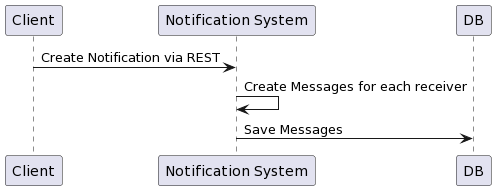
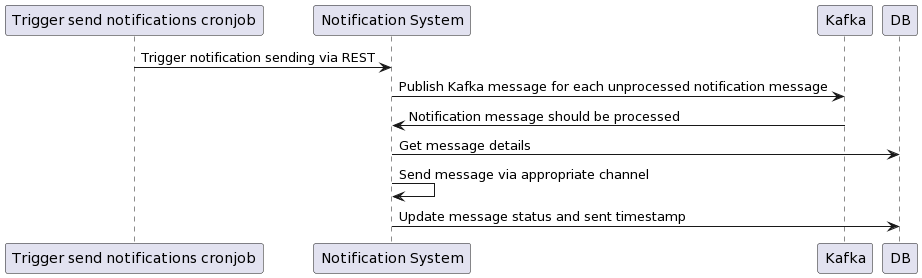
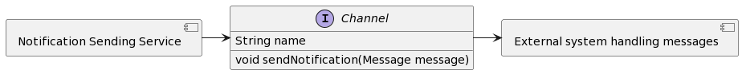

<h1>Notification Sending System</h1>

The Notification Sending System is a system used for sending singular or bulk notifications via multiple supported channels.
Currently, the supported channels are SMS, Email and Slack. By design, the system is extensible to support more channels in the future.

The system is designed to be horizontally scalable with "exactly once" notification sending SLA.
How this is achieved is documented in more details further down.

The interface for creating notifications and checking their statuses is REST API.

<h2>Prerequisites</h2>
Apache Kafka is required by this project.
To run locally, download from https://kafka.apache.org/quickstart and run the following commands: 
    <code>$ bin/zookeeper-server-start.sh config/zookeeper.properties</code>
     
    <code>$ bin/kafka-server-start.sh config/server.properties</code>
  
The project is using a local file database. The path to the file cannot be relative, thus it
is required to set it manually in the application.properties file before starting the application.
To do so, change the spring.datasource.url property to point to your desired file location.

<h2>Design</h2>
The Notification Sending System is designed to send singular or bulk notifications to 
defined receivers via different channels. One notification can have only one channel
and multiple receivers.

Notification creation is triggered via REST API. The user provides the notification 
subject, content, channel and a list of receivers. The Notification Sending System then 
creates notification messages for each receiver and stores them in the database. Thus,
successfully creating a notification via the REST API endpoint only confirms that the system
has received the notification. The actual sending will be handled separately and the 
notification messages statuses can be checked by the user via another REST API endpoint.

A cronjob script has to be scheduled to run regularly (i.e. every minute) to trigger the
actual notification sending. This is done by calling the Notification Sending System REST 
API endpoint for trigger sending of notifications. The system then gets all new
or failed notification messages from the database and publishes their ids to a 
Kafka topic. This is done in order to guarantee that only one instance of the
system will send the notification message and thus the receivers will not get 
duplicate messages. Additionally, by publishing message ids separately, multiple
instances of the Notification Sending System can handle them.

<h3>Improvement points for notification sending</h3>
The notification sending mechanism could be improved with the following points: 
* Make the message sending retryable. I.e. retrying 3 times before updating the message as failed
could help with sporadic issues 
* Current implementation will retry notification sending forever. A limitation should be
introduced, i.e. try 1000 times or try for 3 days. Otherwise, some unprocessable notifications
will keep loading the system forever. 
* The trigger notification sending currently gets all unprocessed messages. Introducing
chunks could help if there are huge loads on the system. I.e. get only the oldest 1000 or 10000
messages instead of all of them. This may, however, slow notification sending as it would limit
the notification sending to no more than 1000 or 10000 per minute (if the cronjob runs every minute) 
* Introducing a REST API endpoint for manually retriggering a failed notification could
help when unexpected issues arise. This would only make sense if a limitation the
times a notification is retried is introduced. Otherwise, the notification will be retried automatically.

<h3>Other future improvement points</h3>
* Logging currently does not write to a file. This should be changed as in production this will be
the best way to debug when there are unexpected issues. 
* In a production system, the credentials for each external system (i.e. the SMTP server, the DB server, etc)
should not be hardcoded as in the current implementation. They could be in S3 bucket or something similar and
loaded on application start as k8s environment variables. 
* Similarly, the configurations for each external system should not be hardcoded. They could be added
to the application.properties file. Additionally, the DB will not be a local file DB system. 
* Docker can be used to containerize the application locally and to set dependencies (i.e. the DB
and Kafka can be docker containers on which the notification sending system depends) 
* Unit, functional and integration testing should be implemented. This was skipped due to the time constraints of the task.

The system is designed to be run in kubernetes with multiple pods and a kubernetes
cronjob for triggering the sending of notifications.

Notification System Use Case Diagram 

 
Notification Creation Diagram 

 
Notification Sending Diagram 

 
Notification Sending Components Diagram 

<h2>Notification channels</h2>
The Notification Sending System currently supports SMS, Email and Slack channels.
It is designed to be easily extensible in the future. To add a new channel, the
Channel interface needs to be implemented.

<h2>Running the Notification Sending System in Production</h2>
The system is designed to run in kubernetes. Depending on the load, it can be scaled horizontally
by increasing the amount of pods.

The actual sending of notifications will be triggered by a simple bash script which calls the trigger
notification sending REST API endpoint of the Notification Sending System. This script will be
scheduled as kubernetes cronjob so that it runs as one instance and avoids message duplication.

It is possible in edge case scenario to have duplicate messages. This could happen if a pod is
processing notifications very slowly and does not manage to finish the processing until the
next run of the cronjob. In this case, the pod can eventually send the notification successfully but
the cronjob would have already sent a processing message to the Kafka topic and another pod will
process it again. There are multiple possibilities to handle this scenario. One is to retry each
notification message with a 10 minute delay. In this case it is still possible to have duplication
but the likelihood of this happening is significantly lower. Another option is to implement a shared
cache between the pods where message ids of messages in process are stored. When a pod starts
processing a message, it will first check if this message id is in the cache. If it is, it will not
process the message a second time.

Using Kafka with the same group id for each pod allows each message to be handled by a single pod.
The notification messages details, including status are stored in the database, so it does not matter
which pod handles the sending.

The system would need most of the improvements mentioned before to be ready for production
deployment. Authorization mechanism should also be implemented to avoid accidental or malicious
notifications to recipients.

<h2>Notification and Message entities content redundancy</h2>
The Message entity contains the exact content the user received. With the current implementation this is redundant with the content in the Notification object.
In a productive system it is possible to have details like placeholders in the notification content which could be different for each user.
For audit purposes it is better to have the exact message for each user instead of the one with the placeholders.

<h2>REST API endpoints</h2>
The interface for the Notification Sending System is REST.
The following endpoints are available: 
1. POST "/notification" 
   * Used to create a notification. This is the entry point for the users of the Notification Sending System. 
   * Example request body 
     <code> {
         "channel": "SMS",
         "subject": "Test Notification",
         "content": "Test notification content",
         "recipients": [
             "+359888888193",
             "+359999999204"
         ]
     } </code> 
2. GET "/messages/{notificationId}" 
   * Returns the notification message details for all messages of notification with the provided notification id 
3. GET "/messages/unprocessed" 
   * Returns all messages with status NEW or FAILED. Ignores SENT messages. 
4. POST "/triggerNotificationSending" 
   * Triggers the actual notification sending in the Notification Sending System. Usually called by the 
   Trigger notification sending cronjob. Ideally would not be accessible from external networks.
